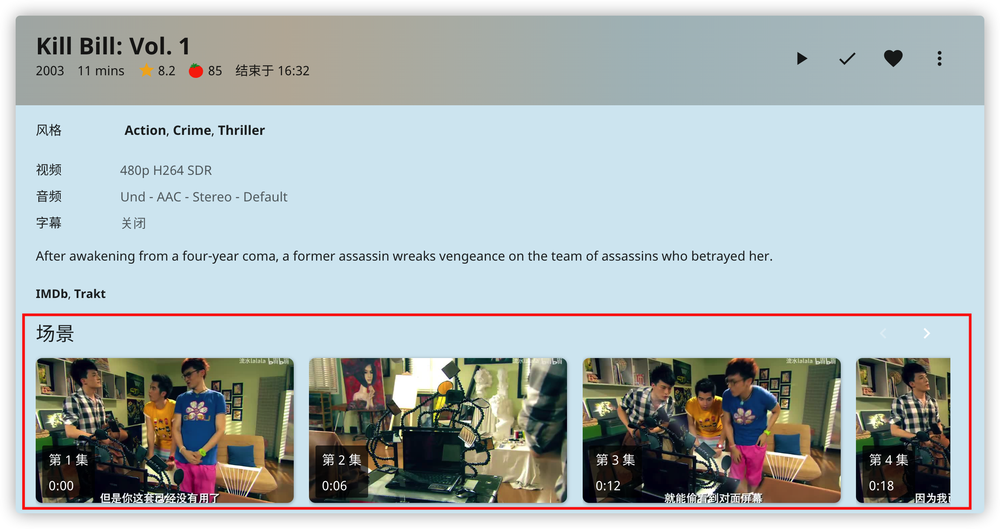
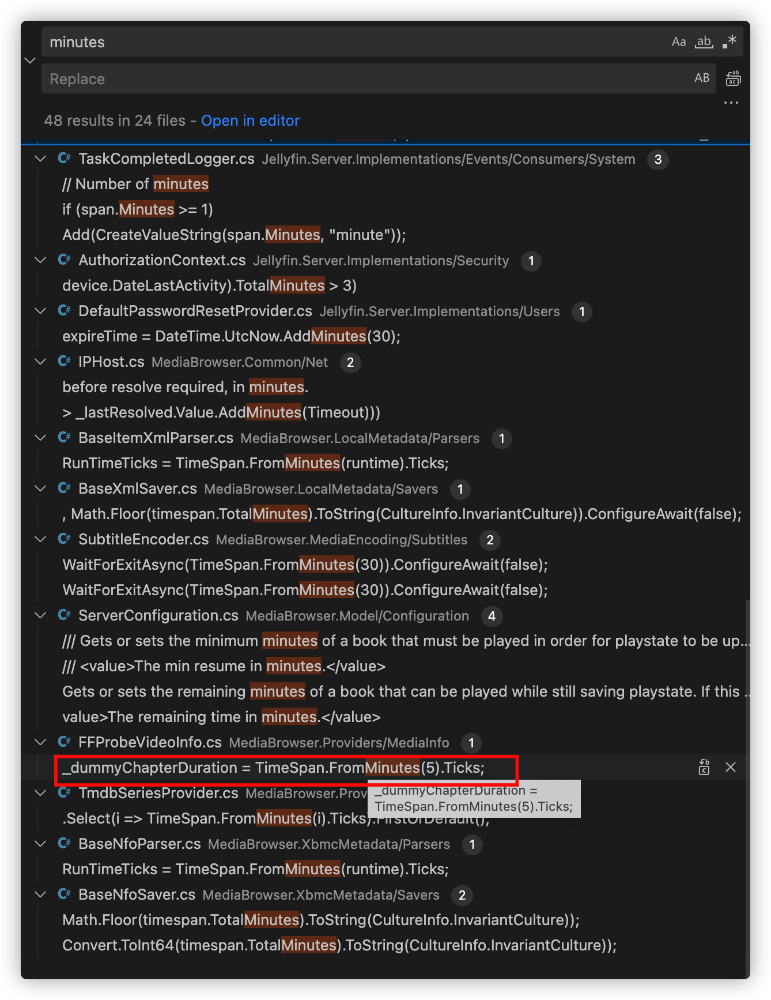
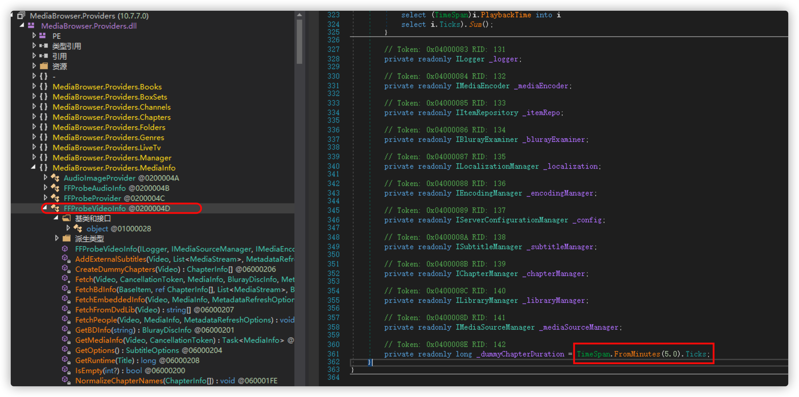

# jellyfin
本镜像基于`linuxserver/jellyfin:10.8.10`将默认的场景生成间隔由5分钟改为了6s，无其他改动。

## 使用方法
镜像可以自己构建也可以直接使用`docker hub`上的 https://hub.docker.com/r/huihuidehui/jellyfin

使用方法和原版镜像一致：https://hub.docker.com/r/linuxserver/jellyfin

## 修改教程

更新：同时需要将最大章节数限制100改一下，我这里改为了5000。并且间隔由6s改为了12s。

上图是将间隔改为6s后的效果，在不考虑cpu、存储占用的前提下效果嘎嘎好。

### 修改方法

在控制台翻一下并没有发现可以设置的地方，google搜了一圈没发现有人提到这个事。不过好在`jellyfin` 是开源的，用着不顺自己改就是了。

### 整体思路：

1.  找到源代码中设置间隔的位置
2.  修改为需要的时间间隔
3.  找到对应的代码文件被编译后所处的dll文件
4.  从正在运行的docker容器中拷贝出对应的dll文件
5.  修改dll文件
6.  再放回去
7.  搞定\~

#### 1. 找到代码中设置间隔的位置

先从github上把源代码下载下来，然后vscode打开。下一步就是定位设置间隔的地方的了，源代码都拿到了那就直接全局搜索就可以了。

考虑全局搜索的关键词：

1.  minutes
2.  数字5
3.  interval

    从结果中找到了一处可疑的地方有关键词`chapterDuration` `minutes` `5` 基本上就可以断定就是它了，所在的dll文件为`MediaBrowswer.Providers.dll`&#x20;

#### 2. 修改对应的dll文件

第一步需要先从docker容器中拷贝出dll文件。我这里用的是`linuxserver`的镜像，`MediaBrowswer.Providers.dll`文件所在的位置为`/usr/lib/jellyfin/bin`目录，直接使用`docker cp`命令拷贝出来。

下一步需要使用`dnspy`对`MediaBrowswer.Providers.dll`进行反编译并修改。如图：把红框中的5.0改为0.1就可以了，时间间隔就被设置成了6s。

修改完成后，将修改后的`MediaBrowswer.Providers.dll`替换掉容器内的原始dll文件即可。

#### 3. 重启jellyfin容器

替换后需要重启jellyfin容器，并重新生成场景图。